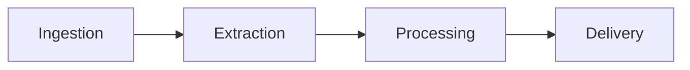
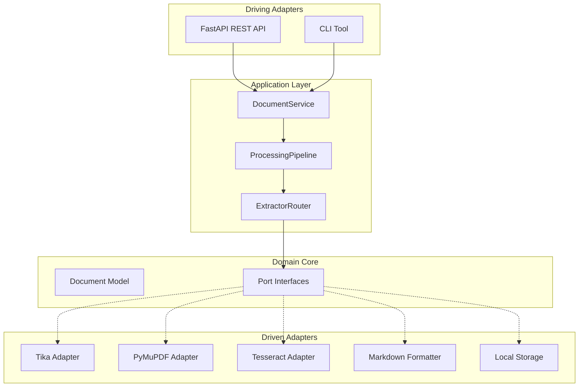

# Architecture Overview

DocFlow follows a **Hexagonal Architecture** (Ports & Adapters) to ensure every technology is swappable without code changes.

---

## Design Principles

| Principle | Implementation |
|-----------|---------------|
| **Dependency Inversion** | Domain knows no infrastructure — only Ports (ABCs) |
| **Single Responsibility** | Each adapter has exactly one responsibility |
| **Open/Closed** | New extractors/OCR engines via plugin — no core changes |
| **Configuration over Code** | Adapter selection via environment variables |

---

## Bounded Contexts



| Context | Responsibility |
|---------|---------------|
| **Ingestion** | File upload, validation, MIME detection, metadata |
| **Extraction** | Raw text extraction from documents |
| **Processing** | Cleanup, structuring, optional LLM enrichment |
| **Delivery** | Formatting (Markdown/JSON/Text), response |

---

## Layer Architecture



---

## Dependency Rule

```
Adapters → Application → Domain → NOTHING
```

- **Domain** has **zero** external dependencies
- **Application** depends only on domain ports
- **Adapters** implement ports and depend on external libraries

---

## Project Structure

```
src/docflow/
├── domain/                     # Zero external deps
│   ├── models.py               # Document, Metadata, Enums
│   ├── events.py               # Domain events
│   └── ports.py                # ABC interfaces (5 ports)
├── application/                # Orchestration
│   ├── config.py               # pydantic-settings
│   ├── pipeline.py             # ExtractorRouter + ProcessingPipeline
│   └── service.py              # DocumentService
├── adapters/
│   ├── inbound/
│   │   ├── api/                # FastAPI (app, routes, schemas, DI)
│   │   └── cli.py              # CLI entry point
│   └── outbound/
│       ├── extractors/         # Tika, PyMuPDF
│       ├── ocr/                # Tesseract
│       ├── processors/         # Cleanup
│       ├── formatters/         # Markdown, JSON, Plain Text
│       └── storage/            # Local filesystem
```

---

## Next Steps

- [Ports & Adapters](ports-and-adapters.md) — detailed port interfaces
- [Pipeline](pipeline.md) — how documents flow through the system
