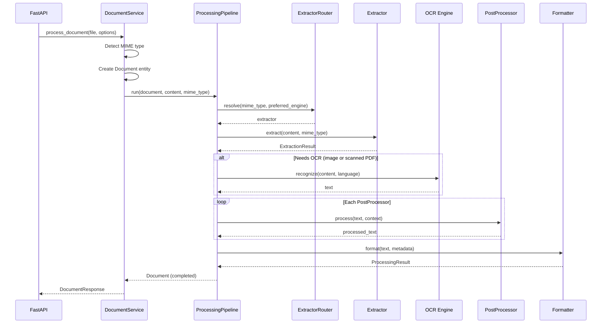

# Processing Pipeline

The pipeline orchestrates the full document processing flow: **Extract → OCR → Process → Format**.

---

## Pipeline Flow



---

## ExtractorRouter

The router selects the best extractor based on MIME type and user preference:

| MIME Type | Default Extractor | Reason |
|-----------|-------------------|--------|
| `application/pdf` | **PyMuPDF** | 10-50x faster, no network |
| `application/msword` | **Tika** | Office format support |
| `image/*` | **Tika** → OCR | Fallback to OCR |
| Everything else | **Tika** | Universal support |

Users can override with `extraction_engine=tika` or `extraction_engine=pymupdf`.

---

## OCR Decision Logic

```python
def _needs_ocr(mime_type, text, ocr_engine):
    if ocr_engine == "none":
        return False
    if mime_type in IMAGE_TYPES:
        return True
    if mime_type == "application/pdf" and len(text.strip()) < 50:
        return True  # Scanned PDF
    return False
```

---

## Error Handling

The pipeline catches all exceptions and marks the document as `failed`:

```python
try:
    # Extract → Process → Format
    document.mark_completed(content, elapsed_ms)
except Exception as exc:
    document.mark_failed(str(exc))
```

No unhandled exceptions propagate to the API layer.
