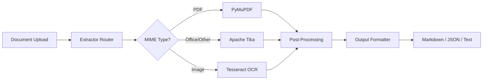

# DocFlow

**End-to-End Document Text Extraction Pipeline** — PDF, Office, Images → Markdown.

DocFlow provides a simple, pluggable pipeline for extracting text from any document format and converting it into structured output. Built for enterprises that need **adaptable, technology-agnostic** document processing.

---

## Features

<div class="grid" markdown>

<div class="grid-item" markdown>
### :material-file-document-multiple: Universal Extraction
PDF, DOCX, XLSX, PPTX, HTML, images, and 1000+ formats via Apache Tika.
</div>

<div class="grid-item" markdown>
### :material-swap-horizontal: Pluggable Architecture
Swap extractors, OCR engines, and post-processors without code changes — just config.
</div>

<div class="grid-item" markdown>
### :material-eye: OCR Built-In
Tesseract OCR for scanned documents and images. Google Vision / Azure ready.
</div>

<div class="grid-item" markdown>
### :material-docker: Docker-First
One command to start: `docker compose up`. Production-ready with health checks.
</div>

<div class="grid-item" markdown>
### :material-api: REST API
FastAPI with OpenAPI docs, file upload, sync extraction, and format selection.
</div>

<div class="grid-item" markdown>
### :material-language-markdown: Markdown Output
Clean Markdown with YAML front matter, or JSON / plain text.
</div>

</div>

---

## Quick Start

```bash
# Clone the repository
git clone https://github.com/stefanposs/doc-flow.git
cd doc-flow

# Start with Docker
docker compose -f docker/docker-compose.yml up -d

# Extract text from a PDF
curl -X POST http://localhost:8000/api/v1/extract \
  -F "file=@document.pdf" \
  -F "output_format=markdown"
```

---

## Architecture at a Glance



---

## Documentation

- **[Installation](getting-started/installation.md)** — setup and dependencies
- **[Quick Start](getting-started/quick-start.md)** — first extraction in 5 minutes
- **[Architecture](architecture/overview.md)** — hexagonal design and bounded contexts
- **[API Reference](api/rest.md)** — REST endpoint documentation

---

## Contributing

Contributions are welcome! See the [Contributing Guide](development/contributing.md) for development setup and workflow.

---

## License

MIT — see [LICENSE](https://github.com/stefanposs/doc-flow/blob/main/LICENSE) for details.
